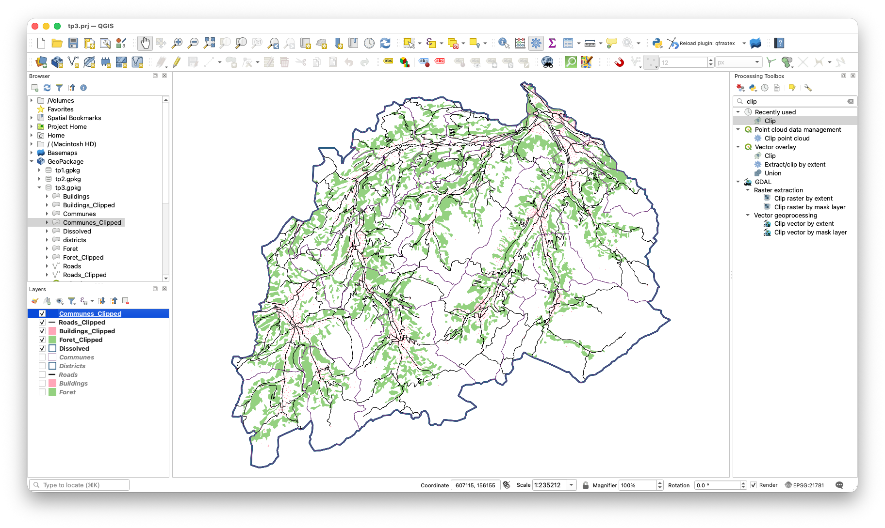

# TP3 : Les outils de géotraitement (vecteurs)

## Introduction

L'objectif de ce TP est de te montrer comment réaliser des analyses spatiales dans les SIG à partir de géodonnées. Tu apprendras à utiliser les principaux outils de géotraitement pour les opérations SIG de base. Une fois que tu auras expérimenté ces outils, tu seras également capable de les utiliser dans ton propre projet si nécessaire !

Nos objectifs pédagogiques sont les suivants :

1. Utiliser les outils de sélection et d'extraction (sélection par expression, découpage)
2. Utiliser les outils de proximité (zone tampon)
3. Utiliser les outils de superposition (intersection, union, différence et regroupement)
4. Construire une chaîne de géotraitements vectoriels sur un cas d'étude concret
5. Automatiser une chaîne de géotraitements avec le modeleur graphique de QGIS

Dans les TP précédents, tu as utilisé **Sélectionner par expression** et **Sélection par localisation**. Dans ce TP, tu vas découvrir :

* _les outils de sélection et d’extraction,_
* _les outils de proximité,_
* _les outils de superposition,_

avec des données vectorielles.

Ce TP n’aurait pas été possible sans les ressources listées ci-dessous :

* _TP6 du cours “Géomatique et SIG” de Privat-docent Dr. Marj Tonini_

## 1\. Cas d’étude et téléchargement des données

Dans cet exercice, tu vas définir la zone d’interface entre l’espace urbain (habitat) et la forêt dans deux [districts](https://fr.wikipedia.org/wiki/District_(Suisse)) du Canton de Berne. Cet espace du territoire, dénommé _Wildland Urban Interface_ (WUI), peut représenter un risque important d’incendie non-contrôlé de forêt et peut mettre en danger la population et les infrastructures.

Réponds aux questions sur [Moodle]({{ MOODLE_QUIZ_TP3 }}) au fur et à mesure de ta progression dans l’exercice !

Les données sont regroupées dans le GeoPackage `tp3.gpkg`, disponible dans le [dossier OneDrive du cours](https://unils-my.sharepoint.com/:f:/g/personal/tom_beucler_unil_ch/IgAbdMV6LtilQocQhWgGGyIrAecbnnShumSyv65fPHE8yqw?e=PeZ9wa).

Il s’agit des données suivantes :

* limites administratives des communes : `Communes` ;
* limites administratives des districts : `Districts` ;
* zone forestière : `Foret` ;
* bâtiments : `Buildings` ;
* routes : `Roads`.

1a) Télécharge le GeoPackage.

1b) Dans le panneau **Explorateur**, développe `tp3.gpkg`, puis ouvre le projet QGIS qu'il contient.

## 2\. Outils de sélection et d’extraction

Ces outils permettent de sélectionner des entités avec une expression ou selon leur position, puis de les exporter dans une nouvelle couche.

Dans cette partie, tu vas délimiter la zone d'étude et en extraire les données utiles. Elle correspond aux districts bernois de _Frutigen-Niedersimmental_ et _Obersimmental-Saanen_.

2a) Sélectionne ces deux districts avec **Sélectionner par expression**, puis exporte les entités sélectionnées dans une nouvelle couche.

Astuce

Ouvre la table attributaire et lance **Sélectionner par expression**, comme dans les TP précédents. Fais ensuite un clic droit sur la couche et choisis **Exporter > Sauvegarder les entités sélectionnées sous…**.

 

Solution

<code>"NAME" ILIKE 'Frutigen-Niedersimmental' OR "NAME" ILIKE 'Obersimmental-Saanen'</code>

 

2b) Utilise l'outil [**Regrouper**](https://docs.qgis.org/3.40/fr/docs/user_manual/processing_algs/qgis/vectorgeometry.html#dissolve) (_Dissolve_) pour fusionner les deux districts en une seule entité.

Astuce

Nomme les couches de sortie de manière explicite, par exemple `Communes_FNOS`, `Batiments_FNOS`, `Foret_FNOS` et `Routes_FNOS`. Ton GeoPackage et ton projet resteront ainsi faciles à comprendre.
⚠️ **Attention :** n’utilise pas d’espaces ni de caractères accentués dans le nom des couches.

 

Solution

 

2c) Découpe ensuite `Communes`, `Buildings`, `Foret` et `Roads` selon ce périmètre avec l'outil [**Couper**](https://docs.qgis.org/3.40/fr/docs/user_manual/processing_algs/qgis/vectoroverlay.html#clip) (_Clip_). Utilise le district regroupé comme couche de superposition.

Solution

 

2d) Une fois les couches découpées, ton fond de carte est prêt. Le résultat devrait ressembler à la capture ci-dessous :

2e) **En utilisant les outils de géotraitement appris jusqu’à présent, réponds aux cinq premières questions sur [Moodle]({{ MOODLE_QUIZ_TP3 }}).**

Astuce Question 3

Utilise l'outil [**Statistiques basiques pour les champs**](https://docs.qgis.org/3.40/fr/docs/user_manual/processing_algs/qgis/vectoranalysis.html#basic-statistics-for-fields) sur le champ de longueur de la couche des routes découpées. Si ce champ n'existe pas, crée-le d'abord avec la Calculatrice de champs et l'expression `$length`. Consulte ensuite la somme dans le rapport généré.

 

Astuce Question 4

Consulte la table attributaire de la couche des deux districts regroupés : la question porte sur leur périmètre total.

 

Astuce Question 5

Commence par sélectionner et extraire la commune de `Wimmis`, comme tu l'as fait pour les districts en 2a. Utilise ensuite **Couper** pour découper la forêt selon cette commune.

 

## 3\. Outils de proximité

Ces outils permettent de détecter les relations de voisinage entre les objets dans l’espace géographique. Ils sont utilisés pour identifier les entités les plus proches les unes des autres et pour calculer les distances exactes entre celles-ci.

Dans cette partie, tu vas utiliser un outil important pour définir l’espace urbain, conventionnellement défini comme l’union des surfaces bâties et du réseau routier.

**Lis attentivement les consignes ci-dessous** avant de commencer dans QGIS !

3a) **Zones tampons** : nous voulons délimiter les groupes de bâtiments séparés par moins de 150 m. Utilise deux fois l'outil [**Zone tampon**](https://docs.qgis.org/3.40/fr/docs/gentle_gis_introduction/vector_spatial_analysis_buffers.html#vector-spatial-analysis-buffers) (_Buffer_) :

1. Crée une zone tampon de **+75 m** autour des bâtiments et active **Dissoudre le résultat**. Les zones de deux bâtiments distants de moins de 150 m se rejoindront.
2. Sur le résultat, crée une seconde zone tampon de **−75 m**. Tu obtiendras la _zone densément bâtie_ (ZDB), avec des limites lissées autour des groupes de bâtiments.

Solution

 

3b) **Zone tampon autour des routes** : suppose que toutes les routes ont une largeur totale de 12 m. Crée donc une zone tampon de **6 m** de chaque côté des lignes et active **Dissoudre le résultat**.

Solution

Procède comme en 3a, avec une distance de 6 m.

 

## 4\. Outils de superposition

Ces outils permettent de superposer plusieurs entités de différentes couches spatiales, facilitant ainsi la combinaison, la suppression, et/ou la modification des entités qu’ils contiennent. Les nouvelles entités qui en résultent sont stockées dans une nouvelle couche.

Dans cette partie, tu vas définir l'interface habitat-forêt (WUI) avec les outils **Union**, **Différence** et **Intersection**.

4a) **Combinaison des entités** : définis la zone urbaine (ZU) avec l'outil [**Union**](https://docs.qgis.org/3.40/fr/docs/user_manual/processing_algs/qgis/vectoroverlay.html#union), en combinant la ZDB avec la zone tampon des routes. Applique ensuite **Regrouper** au résultat pour obtenir une géométrie sans limites internes inutiles.

Solution

Si l'enregistrement échoue à cause du champ `fid`, n'exporte pas ce champ : le GeoPackage créera automatiquement un identifiant unique.

 

4b) **Zone d'interface** : pour cet exercice, utilise une distance conventionnelle de 80 m autour de la zone urbaine afin de définir la WUI. Procède comme suit :

1. Construis une zone tampon de 80 m autour de la ZU et active **Dissoudre le résultat**.
2. Utilise [**Différence**](https://docs.qgis.org/3.40/fr/docs/user_manual/processing_algs/qgis/vectoroverlay.html#difference) avec la zone tampon comme couche source et la ZU comme couche de superposition. Le résultat est l'anneau situé jusqu'à 80 m de la ZU, sans la ZU elle-même.

Solution

 

<!-- Cette fois, dans l’option _Side Type_ choisi _Exclude the input polygon from buffer,_ tandis que les autres options sont les mêmes que pour la zone urbaine densément bâtie (ZDB). -->

[Source](https://www.britannica.com/science/forest-fire)

4c) **Croiser deux couches** : intersecte l'anneau de 80 m avec la surface forestière à l'aide de l'outil [**Intersection**](https://docs.qgis.org/3.40/fr/docs/user_manual/processing_algs/qgis/vectoroverlay.html#intersection). Nomme la couche de sortie `WUI`.

Solution

Si l'enregistrement échoue à cause du champ `fid`, n'exporte pas ce champ afin que le GeoPackage crée un identifiant unique :

 

## 5\. Automatiser avec le modeleur graphique

Tu viens d'enchaîner plusieurs géotraitements à la main : sélection, regroupement, découpe, zones tampons, union, différence et intersection. QGIS permet d'automatiser une telle chaîne avec le [**Modeleur graphique**](https://docs.qgis.org/3.40/fr/docs/user_manual/processing/modeler.html) (_Model Designer_). Tu vas d'abord construire un modèle simple, puis tu pourras reproduire la chaîne WUI sans la partie sur les routes comme défi facultatif.

:::{important}
Le **Modeleur graphique** permet de :
* enchaîner des algorithmes dans un diagramme visuel ;
* définir des **entrées** réutilisables (couches, paramètres) ;
* **exécuter** toute la chaîne en un clic ;
* **partager** le modèle (fichier `.model3`) — utile pour ton projet individuel !
:::

5a) Ouvre **Traitement > Modeleur graphique…**.

5b) Ajoute les **entrées** dans le panneau **Entrées** :
* **Couche vecteur** (polygones) → nomme-la "Districts"
* **Couche vecteur** (polygones) → nomme-la "Forêt"
* **Couche vecteur** (polygones) → nomme-la "Bâtiments"

5c) Pour le **modèle obligatoire**, ajoute les trois premiers algorithmes et définis la forêt découpée comme sortie du modèle :
1. `Extraire par expression` sur "Districts" → extrait les deux districts
2. `Regrouper` → un seul polygone
3. `Couper` : forêt découpée par le district regroupé

Pour le **défi facultatif**, prolonge le modèle avec les étapes suivantes :

4. `Couper` : bâtiments découpés par le district regroupé
5. `Zone tampon` (+75 m, **Dissoudre le résultat**) sur les bâtiments découpés
6. `Zone tampon` (−75 m) → ZDB
7. `Zone tampon` (+80 m, **Dissoudre le résultat**) sur la ZDB → zone de risque
8. `Différence` : entrée = zone de risque ; superposition = ZDB
9. `Intersection` : entrée = résultat de la différence ; superposition = forêt découpée → **WUI**

Astuce

Lorsque tu ajoutes un algorithme, choisis comme couche d'entrée soit une **Entrée du modèle**, soit la **Sortie d'algorithme** de l'étape précédente. Le modeleur crée automatiquement les liens dans le diagramme.

 

5d) Donne un nom et un groupe au modèle. Dans le dernier algorithme obligatoire, définis la forêt découpée comme **Sortie du modèle**. Si tu réalises le défi, définis plutôt la sortie de l'intersection comme **Sortie du modèle** et nomme-la `WUI`. Enregistre le fichier `.model3`, puis exécute le modèle en sélectionnant les couches d'entrée.

Solution

 

:::{note}
Un modèle avec **trois algorithmes connectés et une sortie** suffit pour ce TP. La chaîne WUI complète est un défi facultatif. Tu réutiliseras cette compétence dans ton **projet individuel**.
:::

## 6\. Soumission du TP

**Bravo !** Tu as réalisé ton premier projet avec des outils de géotraitement. Il ne te reste plus qu'à préparer la remise :

6a) Crée une [mise en page](https://docs.qgis.org/3.40/fr/docs/user_manual/print_composer/overview_composer.html#overview-of-the-print-layout), comme au TP2. Ajoute un titre, ton nom, la date, une légende, une barre d'échelle, une flèche du nord et la source des données : _[swisstopo](https://www.swisstopo.admin.ch/), VECTOR200_. Utilise une palette lisible.

6b) Exporte la carte [au format PDF](https://docs.qgis.org/3.40/fr/docs/user_manual/print_composer/overview_composer.html#export-settings), nomme-la `nom_prenom_TP3.pdf`, puis dépose-la dans [Rendu_TP3_Carte_PDF]({{ MOODLE_RENDU_TP3_CARTE }}).

6c) **Empaquette ton projet** selon la méthode du TP1 (§9) : place le projet `.qgz`, le GeoPackage contenant tes couches de sortie et le modèle `.model3` dans un dossier, vérifie le projet, puis compresse le dossier en `nom_prenom_TP3.zip`. Dépose-le sous [Projet_TP3]({{ MOODLE_RENDU_TP3_PROJET }}).

6d) Réponds enfin aux dernières questions du [Quiz_TP3]({{ MOODLE_QUIZ_TP3 }}).

Félicitations pour ta _WUI_ ! Tu apprendras ensuite à créer ta première carte thématique.
