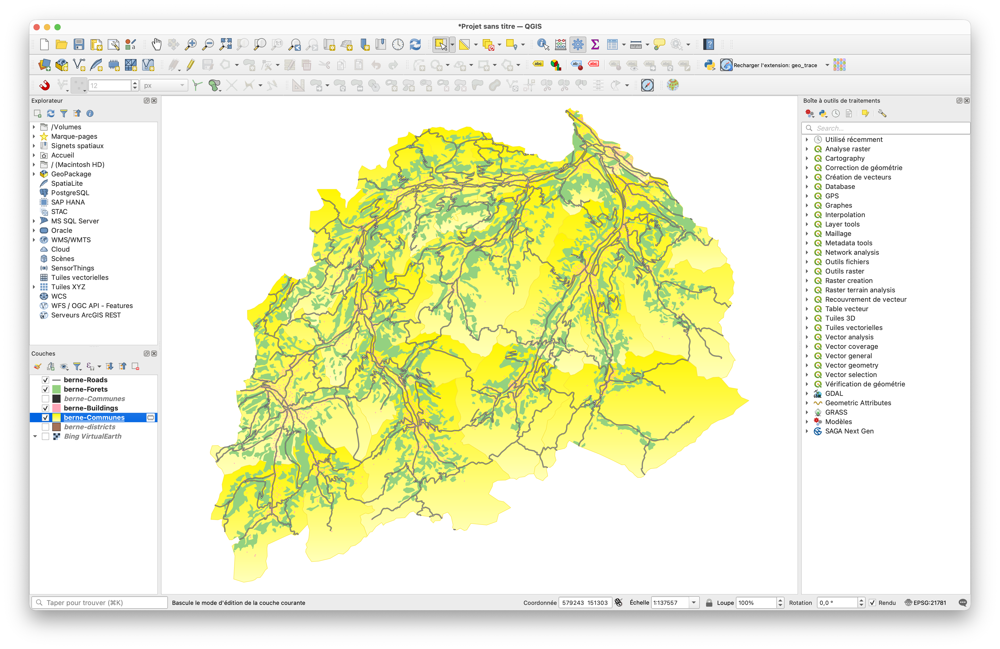

# TP3 : Les outils de géotraitement (vecteurs)

## Introduction

L’objectif de ce TP est de te montrer comment réaliser des analyses spatiales dans les SIG à partir de géodonnées. Tu apprendras à utiliser les principaux outils de géotraitement pour les opérations SIG de base. Une fois que tu auras expérimenté ces outils, tu seras également capable de les utiliser dans ton propre projet si nécessaire !

Dans les TP précédents, tu as appris à utiliser les outils de gestion des tables attributaires (_Select by attribute_, _Select by location_). Dans ce TP, nous allons apprendre comment utiliser :

* _les outils de sélection et d’extraction,_
* _les outils de proximité,_
* _les outils de superposition,_

avec des données vectorielles.

Ce TP n’aurait pas été possible sans les ressources listées ci-dessous:

* _TP6 du cours “Géomatique et SIG” de Privat-docent Dr. Marj Tonini_

## 1\. Cas d’étude et téléchargement des données

Dans cet exercice, tu vas définir la zone d’interface entre l’espace urbain (habitat) et la forêt dans deux [districts](https://fr.wikipedia.org/wiki/District_(Suisse)) du Canton de Berne. Cet espace du territoire, dénommé _Wildland Urban Interface_ (WUI), peut représenter un risque important d’incendie non-contrôlé de forêt et peut mettre en danger la population et les infrastructures.

Réponds aux questions sur Moodle au fur et à mesure de ta progression dans l’exercice !

Les données à télécharger sont contenues dans le geopackage [tp3.gpkg](https://unils-my.sharepoint.com/:f:/g/personal/ayoub_fatihi_unil_ch/IgDD5wH1DzKtTp1vLVbGrsfoAWbEkhSnB92HPaI1e0EiBu0?e=4EmmQr) situé dans le dossier OneDrive du cours.

Il s’agit des données suivantes :

* _limites administratives des communes : « Communes.shp »_
* _limites administratives des districts : « Districts.shp »_
* _zone forestière : « Foret.shp »_
* _bâtiments : « Buildings.shp »_
* _routes : « Roads.shp »_

1a) Télécharge donc le dossier et décompresse-le.

1b) Ensuite, ajoute les couches dans une nouvelle géodatabase et appelle-la “_WUI.gdb_”.

## 2\. Outils de sélection et d’extraction

Avec ces outils, les entités d’une couche ou d’une table d’attributs peuvent être sélectionnées de manière interactive à l’aide de requêtes SQL, et des extractions spatiales peuvent être effectuées. Il est également possible (et souvent pratique) d’exporter les entités sélectionnées vers une nouvelle couche ou un nouveau tableau.

Dans cette partie on va encadrer la région d’étude et extraire les données correspondantes, à l’aide d’outils de géotraitement de base. À partir des couches contenues dans le dossier _Data\_TP_5, notre objectif est de délimiter la zone d’étude en affichant seulement les éléments nécessaires au sein de son périmètre. La zone d’étude choisie correspond aux districts bernois de _Frutigen-Niedersimmental_ et _Obersimmental-Saanen_.

2a) Commence en sélectionnant ces deux districts et extrais-les à l’aide d’une `Sélection par expression` et crée une nouvelle couche avec seulement ces 2 districts.

Astuce

En ouvrant la table des attributs, procède à une sélection par attributs, comme tu l’as appris dans les TP précédents. Ensuite, par un clic droit sur la couche, exporte les éléments vers une nouvelle couche.

 

Solution

`"NAME" ILIKE 'Frutigen-Niedersimmental' OR "NAME" ILIKE 'Obersimmental-Saanen'`

 

2b) Maintenant, à l’aide de l’outil d'Éditer les géométries [Fusionner les entités sélectionnées](https://docs.qgis.org/3.40/fr/docs/user_manual/working_with_vector/editing_geometry_attributes.html#merge-selected-features), fusionne les deux districts en une seule entité.

Astuce

Nomme les couches de sortie de manière logique (e.g., `Communes\_FNOS`, `Batiments\_FNOS`, `Foret\_FNOS` et `Routes\_FNOS`). Cela te permettra de garder ta géodatabase organisée et de rendre ton projet plus compréhensible.
⚠️**Attention⚠️:** n’utilise pas d’espaces ni de caractères spéciaux (tels que les accents) lorsque tu nommes tes couches!

 

Solution

 

2c) Une fois le périmètre de la zone d’étude délimité, on peut découper les autres couches dans ce périmètre. Pour ce faire, utilise l’outil de géotraitement [Couper](hhttps://docs.qgis.org/3.40/fr/docs/user_manual/processing_algs/qgis/vectoroverlay.html#clip).

Solution

 

2d) Une fois les couches découpées grâce à l’outil Clip, ton fond de carte est prêt. Le résultat devrait être semblable à la capture d’écran ci-dessous :

2e) **En utilisant les outils de géotraitements appris jusqu’à présent, réponds aux 5 premières questions sur Moodle.**

Astuce Question 3

#TODO!
Utilise l’outil “[Résumés statistiques](https://pro.arcgis.com/fr/pro-app/latest/tool-reference/analysis/summary-statistics.htm)” dans la table d’attribut de ta couche des routes grâce à “Summarize”, et observe la table de sortie résultante.

 

Astuce Question 4

Fais attention de regarder la table d’attribut de la bonne couche ! Nous cherchons le périmètre des deux districts fusionnés.

 

Astuce Question 5

Commence par sélectionner et extraire la commune de Willis comme tu l’as fait au début de ce TP pour les districts (2a), puis utilise l’outil de géotraitement *Couper* pour découper les forêts de la commune de Willis.

 

## 3\. Outils de proximité

Ces outils permettent de détecter les relations de voisinage entre les objets dans l’espace géographique. Ils sont utilisés pour identifier les entités les plus proches les unes des autres et pour calculer les distances exactes entre celles-ci.

Dans cette partie, tu vas utiliser un outil important pour définir l’espace urbain, conventionnellement défini comme l’union des surfaces bâties et du réseau routier.

**Lis attentivement les conseils ci-dessous** avant de te lancer dans ton travail sur QGIS!

3a) **Zones tampons (Buffer)**: Nous souhaitons définir la zone où les bâtiments se trouvent à moins de 150 mètres les uns des autres pour délimiter la _zone urbaine_. Une solution est d’utiliser l’opération [Zone tampon](https://docs.qgis.org/3.40/fr/docs/gentle_gis_introduction/vector_spatial_analysis_buffers.html#vector-spatial-analysis-buffers) deux fois:

1. Pour définir l’espace de 150 mètres autour des bâtiments, utilise une distance de **\+ 75 mètres** dans les options et cocher l'option **Regrouper le résultat**.
2. Pour éliminer le polygone qui définit la surface à l’extérieur de la zone densément bâtie, il nous faut créer une **deuxième zone tampon** à partir de la première, en saisissant cette fois la valeur négative de **– 75 mètres** dans l’option distance. Le résultat te donnera une couche représentant uniquement la _Zone urbaine Densément Bâtie (ZDB)_.

Solution

 

3b) **Buffer sur les routes**: Cette fois, il nous faut créer des zones tampons en prenant en compte la largeur de chaque type de route. Pour simplifier l’exercice, nous pouvons faire l’hypothèse que toutes les routes ont une largeur de 12 mètres. 12 mètres correspondant à la largeur totale de chaque route, il nous faudra donc utiliser une distance de **6 mètres** (i.e., la moitié de la largeur) pour calculer la zone tampon.

## 4\. Outils de superposition

Ces outils permettent de superposer plusieurs entités de différentes couches spatiales, facilitant ainsi la combinaison, la suppression, et/ou la modification des entités qu’ils contiennent. Les nouvelles entités qui en résultent sont stockées dans une nouvelle couche.

Dans cette partie, tu vas enfin définir la zone d’interface habitat-forêt (WUI), grâce à deux autres outils de géotraitement: _Union_ et _Intersect_.

4a) **Agrégation des entités** : Pour définir l’ensemble de la Zone Urbaine (ZU), agrège les couches correspondant aux infrastructures urbaines avec l’outil [Union](https://docs.qgis.org/3.40/en/docs/user_manual/processing_algs/qgis/vectoroverlay.html#union) (i.e., il faut agréger la ZDB avec les routes après l’opération _buffer_).

4b) **Risque d’incendies forestiers** : En moyenne, 80% des incendies forestiers en Suisse se produisent à une distance qui va jusqu’à 80 mètres de la zone urbaine. Par conséquent, pour définir les zones qui constituent la WUI, commence par construire une zone tampon de 80 mètres autour de la zone urbaine. Puis utilise l'outil [Différence](https://docs.qgis.org/3.40/fr/docs/user_manual/processing_algs/qgis/vectoroverlay.html#difference) pour soustraire (ZU) pour en rester avec uniquement la zone à proximité de la (ZU).

<!-- Cette fois, dans l’option _Side Type_ choisi _Exclude the input polygon from buffer,_ tandis que les autres options sont les mêmes que pour la zone urbaine densément bâtie (ZDB). -->

[Source](https://www.britannica.com/science/forest-fire)

4c) **Croiser deux couches** : Maintenant il ne nous reste plus qu’à “croiser” la zone tampon de 80 mètres que tu viens de créer avec la couche de la surface forestière pour obtenir la zone d’interface habitat-forêt (WUI). Pour ce faire, utilise l’outil [Intersection](https://docs.qgis.org/3.40/fr/docs/user_manual/processing_algs/qgis/vectoroverlay.html#intersection) et nomme la couche de sortie _WUI._

## 5\. Soumission du TP

**Bravo !** Tu as ainsi réalisé ton premier projet en utilisant des outils de géotraitement ! ⚒️ Il ne te reste plus qu’à:

5a) passer dans la [_Print Layout_](https://docs.qgis.org/3.40/fr/docs/user_manual/print_composer/overview_composer.html#overview-of-the-print-layout) et faire une jolie mise en page de ta carte. N’oublie pas d’afficher les élements essentiels d’habillage cartographiques (nom, date, légende, échelle, flèche du nord, bon usage de la palette des couleurs, etc…). La source des donnée est _[swisstopo](https://www.swisstopo.admin.ch/)_ (VECTOR200).

5b) Enfin, pour la remise des fichiers sur Moodle **rends ta carte (magnifique) au format .pdf** ([exportation en PDF](https://docs.qgis.org/3.40/fr/docs/user_manual/print_composer/overview_composer.html#export-settings)) **sous** [Rendu\_TP3\_Carte\_PDF](https://moodle.unil.ch/mod/assign/view.php?id=1736942) **en la nommant de la manière suivante : _nom\_prénom\_TP3_**

5c) **geopackage (.gpkg)** sous [Projet\_TP3](https://moodle.unil.ch/mod/quiz/view.php?id=1736941) en le nommant de la manière suivante : _nom_\__prénom_\__TP3_., et contenant ton  **projet** (en utilisant la méthode `Project> Save To > Geopackage`) ainsi que toute les couches utilisées.

5d) et répond aux dernières questions du [Quiz\_TP3](https://moodle.unil.ch/mod/quiz/view.php?id=1736940).

Félicitations pour ta _WUI_ et à très bientôt pour en apprendre plus sur comment créer ta première carte thématique !
